# Wanderlust

Wanderlust is a full-stack vacation rental platform inspired by Airbnb, designed to provide a complete property hosting and booking experience. Users can browse listings, search destinations with live suggestions, make bookings through an interactive availability calendar, manage their profiles, upload listing images, leave reviews, and securely manage their own properties through authentication and authorization. The application follows the MVC architecture and emphasizes scalable backend design, clean UI/UX, and real-world business logic.

## Project Highlights

- Secure Authentication & Authorization
- Complete Booking & Reservation System
- Interactive Booking Calendar with Date Availability
- User Profile Dashboard
- Live Search Suggestions
- Cloudinary Image Uploads
- Review & Rating System
- Advanced Search & Category Filtering
- Persistent Login Sessions using MongoDB
- Fully Redesigned Modern User Interface
- MVC Architecture

## Features

### Authentication & Authorization
- User Registration, Login and Logout
- Secure Password Hashing using Passport Local
- Role-based Authorization for Listings and Reviews
- Persistent Login Sessions using MongoDB Session Store

### Listings
- Create, Edit and Delete Listings
- Upload Images using Cloudinary
- Set Maximum Guest Capacity
- Listing Owner Management
- Responsive Listing Detail Page

### Booking System
- Interactive Date Picker
- Prevents Double Bookings using Date Overlap Validation
- Live Availability Calendar
- Guest Count Validation
- Automatic Price Calculation
- 18% GST Calculation
- Booking Confirmation Page
- Booking Cancellation
- Daily Automatic Booking Completion Scheduler
- "Your Bookings" section for every listing

### Reviews
- Add Reviews and Ratings
- Delete Own Reviews
- Review Author Authorization
- Rating Display

### User Profile
- Personal Dashboard
- View My Listings
- View My Bookings
- View My Reviews
- Edit Profile
- Change Password

### Search & Filtering
- Search Listings by Title, Location and Country
- Live Search Suggestions
- Debounced Search API
- Category-based Filtering

### User Experience
- Responsive Design
- Modern Landing Page
- Sticky Booking Widget
- Redesigned Navigation Bar
- Scrollable Category Filters
- Scroll-to-Bottom Button
- Consistent Design System
- Flash Messages for User Feedback

## Tech Stack

### Frontend
- HTML5
- CSS3
- Bootstrap 5
- JavaScript (ES6)
- EJS
- Flatpickr (Interactive Date Picker)

### Backend
- Node.js
- Express.js

### Database
- MongoDB
- Mongoose

### Authentication
- Passport.js
- Passport Local

### Image Storage
- Cloudinary
- Multer
- Multer Storage Cloudinary

### Session Management
- Express Session
- Connect Mongo
- Connect Flash

### Other Tools
- Express Session
- Connect Flash
- Joi Validation
- Method Override

## Screenshots

### Home Page

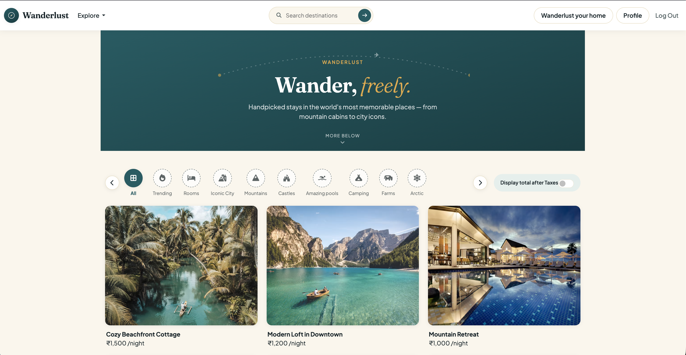

### Listing Details

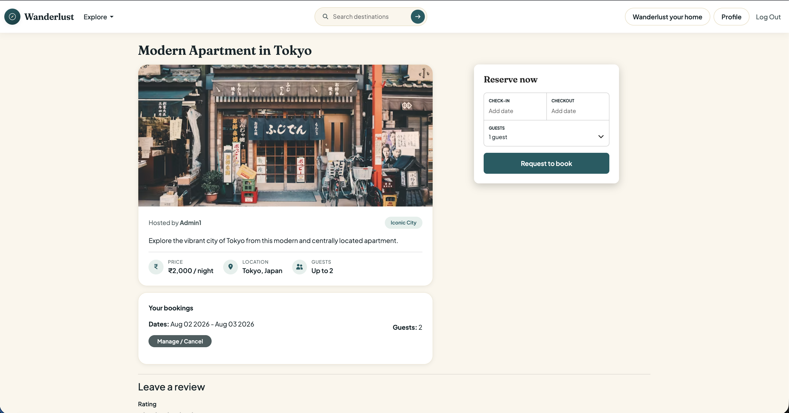

### Search Functionality

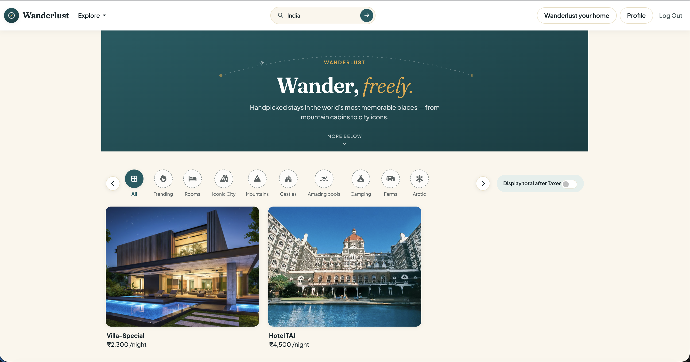

### Category Filtering

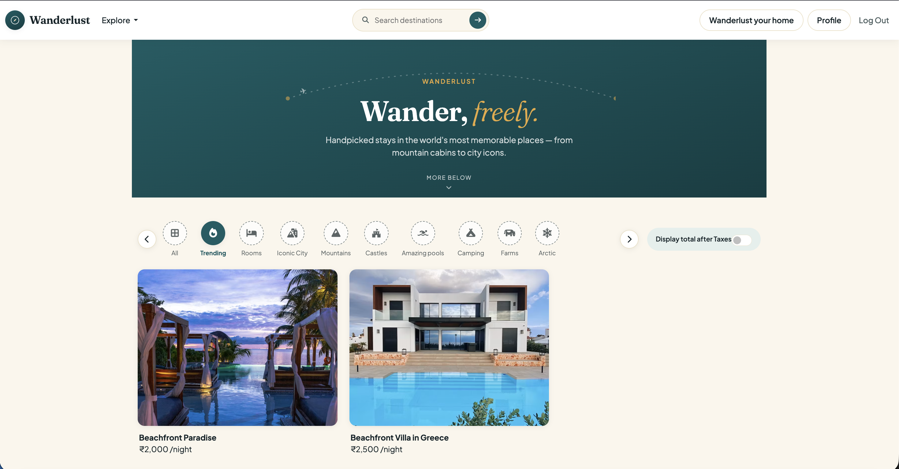

### Login Page

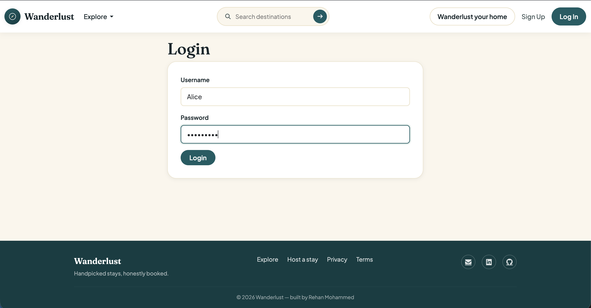

### Create Listing

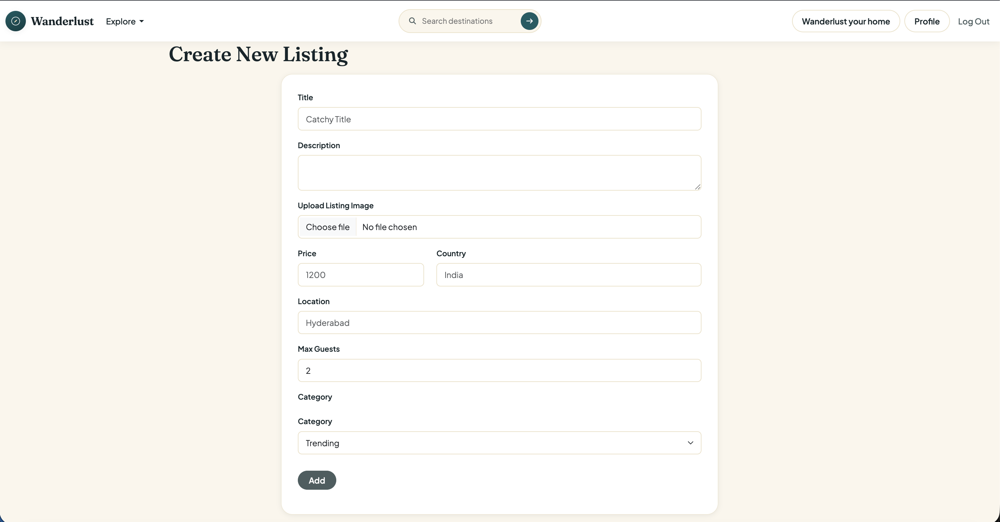

### Booking Listing

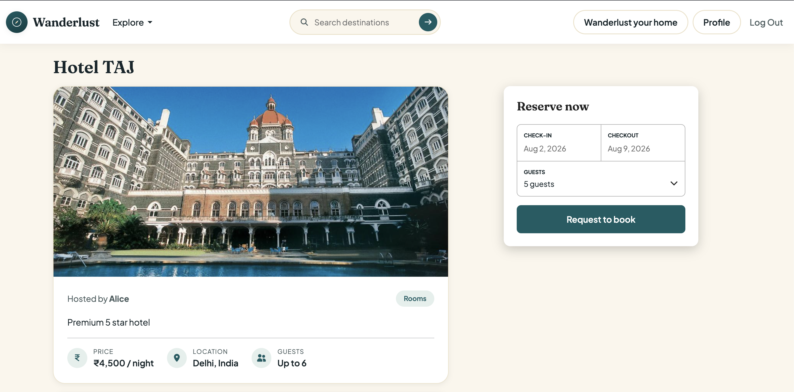

### Confirmed Booking

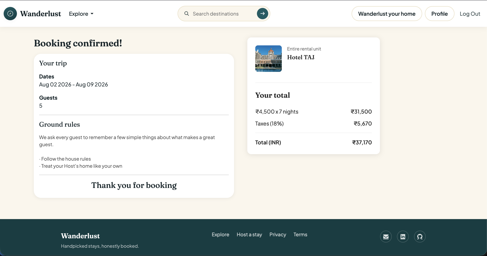

### User Profile

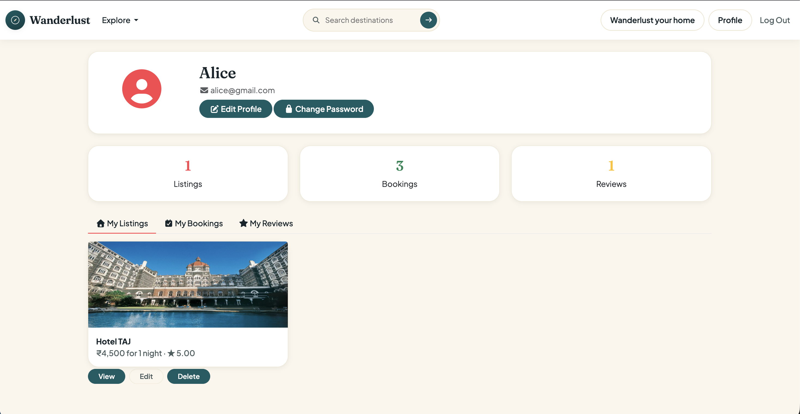

### Edit Profile

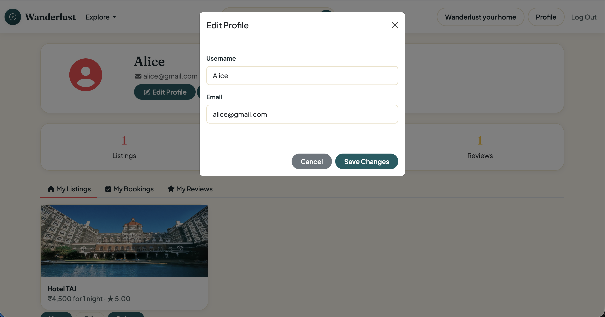

### Change Password

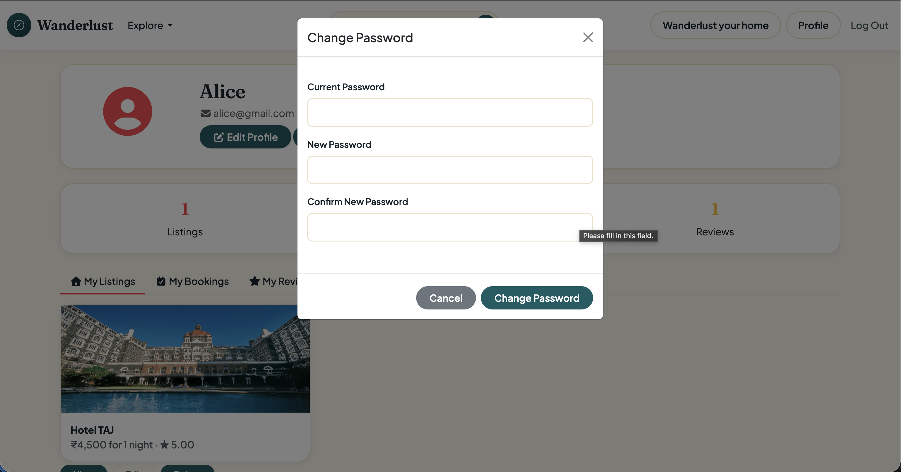

## Project Structure

```text
Wanderlust/
│
├── controllers/
│   ├── listings.js
│   ├── reviews.js
│   ├── users.js
│   ├── bookings.js
│   └── profiles.js
│
├── models/
│   ├── listing.js
│   ├── review.js
│   ├── user.js
│   └── booking.js
│
├── routes/
│   ├── listing.js
│   ├── review.js
│   ├── user.js
│   ├── booking.js
│   └── profile.js
│
├── views/
│   ├── includes/
│   │   ├── navbar.ejs
│   │   ├── footer.ejs
│   │   └── flash.ejs
│   │
│   ├── layouts/
│   │   └── boilerplate.ejs
│   │
│   ├── listings/
│   │   ├── index.ejs
│   │   ├── show.ejs
│   │   ├── new.ejs
│   │   └── edit.ejs
│   │
│   ├── users/
│   │   ├── signup.ejs
│   │   ├── login.ejs
│   │   └── profile.ejs
│   │
│   ├── bookings/
│   │   ├── booking.ejs
│   │   └── cancellation.ejs
│   │
│   └── error.ejs
│
├── public/
│   ├── css/
│   │   ├── style.css
│   │   ├── rating.css
│   │   ├── show.css
│   │   ├── booking-widget.css
│   │   └── bookingdetails.css
│   │
│   └── js/
│       ├── script.js
│       └── datePicker.js
│
├── screenshots/
│   ├── home.png
│   ├── listing-details.png
│   ├── search.png
│   ├── filter.png
│   ├── login.png
│   ├── create-listing.png
│   ├── booking.png
│   ├── confirmed-booking.png
│   ├── profile.png
│   ├── edit-profile.png
│   └── change-password.png
│
├── init/
│   ├── data.js
│   └── index.js
│
├── utils/
│   ├── ExpressError.js
│   ├── wrapAsync.js
│   └── scheduler.js
│
├── middleware.js
├── cloudConfig.js
├── schema.js
├── app.js
├── package.json
├── package-lock.json
├── .gitignore
└── README.md
```

## Architecture

The application follows the MVC (Model-View-Controller) architecture:

- Models manage MongoDB data and schema definitions.
- Views render dynamic UI using EJS templates.
- Controllers contain business logic.
- Routes define application endpoints and connect requests to controllers.
- Middleware handles authentication, authorization, validation, and error handling.

## Installation

1. Clone the repository:

   ```bash
   git clone https://github.com/AbdulRehan-2806/Wanderlust.git
   cd Wanderlust
   ```

2. Install dependencies:

   ```bash
   npm install
   ```

3. Start the application:

   ```bash
   node app.js
   ```
4. Open your browser and navigate to `http://localhost:8080` to access the application.

## Environment Variables

Create a `.env` file in the root directory and add the following variables:

```env
SECRET=your_secret_key
CLOUD_NAME=your_cloud_name
CLOUD_API_KEY=your_cloud_api_key
CLOUD_API_SECRET=your_cloud_api_secret
```

## Future Improvements
    - Wishlist / Favorites Functionality
    - Google OAuth Authentication
    - Payment Gateway Integration
    - Interactive Maps Integration

## Author
   **Abdul Rehan**

GitHub: https://github.com/AbdulRehan-2806

Wanderlust was developed as a full-stack web application to gain practical experience in backend development, authentication, authorization, database design, booking workflows, session management, image storage, and modern web application architecture using Node.js, Express.js, MongoDB, Passport.js, Cloudinary, and the MVC design pattern.